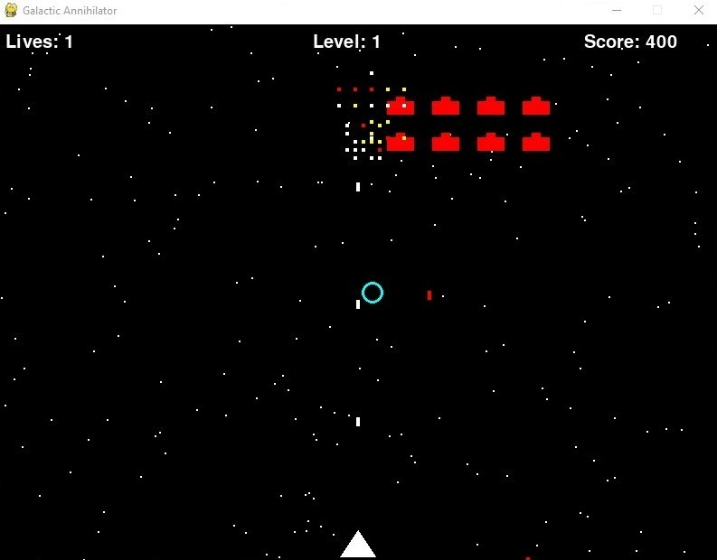

# Galactic Annihilator

<p align="center">
  
</p>

A complete, feature-rich, and polished arcade space shooter built with Pygame. This project serves as an example of a well-structured game, demonstrating advanced features like game states, particle effects, and dynamic difficulty scaling. The entire game is contained within a single Python file with no external asset dependencies.


## Features

*   **Classic Arcade Gameplay**: Fast-paced, top-down space shooter action.
*   **Dynamic Enemy Waves**: Enemies spawn in formations and increase in number and speed as you progress through levels.
*   **Player Power-ups**: Collect drops from defeated enemies to gain temporary advantages:
    *   **Shield**: Makes you invincible for a short duration.
    *   **Rapid Fire**: Doubles your shooting speed.
*   **Visual "Juice"**: The game feels alive with responsive effects:
    *   **Particle Explosions**: Enemies shatter into particles upon destruction.
    *   **Screen Shake**: The screen shakes when the player takes damage, adding impact.
    *   **Scrolling Starfield**: A multi-layered parallax background gives a sense of speed and depth.
*   **Structured Game States**: A robust state machine handles transitions between the main menu, the core game loop, and the game-over screen.
*   **Self-Contained Code**: The entire game is programmed in a single file. All visuals are drawn procedurally using Pygame's drawing functions—no image or sound files are required to run it.

## How to Play

*   **Move**: Use the `LEFT` and `RIGHT` arrow keys.
*   **Shoot**: Press the `SPACEBAR`.
*   **Navigate Menus**: Use the `ENTER` key to start or restart the game and the `ESC` key to return to the main menu.

## Requirements & Installation

1.  **Python 3.x** must be installed on your system.
2.  **Pygame** library is required. Install it via pip:
    ```bash
    pip install pygame
    ```
3.  Download the `game.py` file.
4.  Run the game from your terminal:
    ```bash
    python game.py
    ```

## Code Architecture

The program is architected using an object-oriented approach to separate concerns and make the code manageable and extensible.

*   **`Game` Class**: This is the central orchestrator. It manages the main game loop, screen setup, clock, game states (`START_MENU`, `PLAYING`, `GAME_OVER`), event handling, and calls the update/draw methods for all other objects.

*   **Sprite Classes**: The game's entities are modular `pygame.sprite.Sprite` objects:
    *   **`Player`**: Manages player state, including position, lives, score, and power-up status (shield, rapid-fire). Handles input for movement and shooting.
    *   **`Enemy`**: Defines the behavior for a single enemy ship, including its movement pattern.
    *   **`Bullet`**: A generic class for projectiles, used by both the player and enemies. It's customized on creation with a specific speed and color.
    *   **`PowerUp`**: Represents the collectible items dropped by enemies. It has a type (`shield` or `rapid_fire`) and a limited lifespan.
    *   **`Particle`**: A short-lived sprite used to create the explosion effects. Each particle has a random velocity, creating a dynamic burst effect.

*   **Game Loop Logic**: The core loop in the `Game.run()` method checks the current `game_state` and calls the appropriate handler function (`handle_playing_events`, `update_game_state`, `draw_game`, etc.). This state-driven design prevents menu logic from interfering with gameplay logic and vice-versa, resulting in clean and predictable code. Collision detection and game progression (leveling up, spawning new waves) are handled within the `update_game_state` method.

# Important

Any code, readme, file, etc....., everything has been generated by Cody
